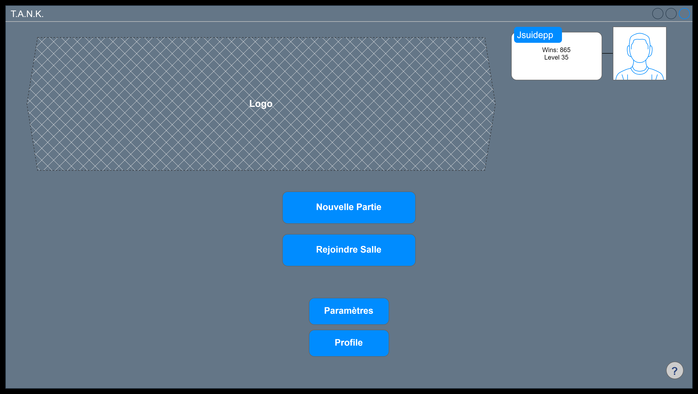
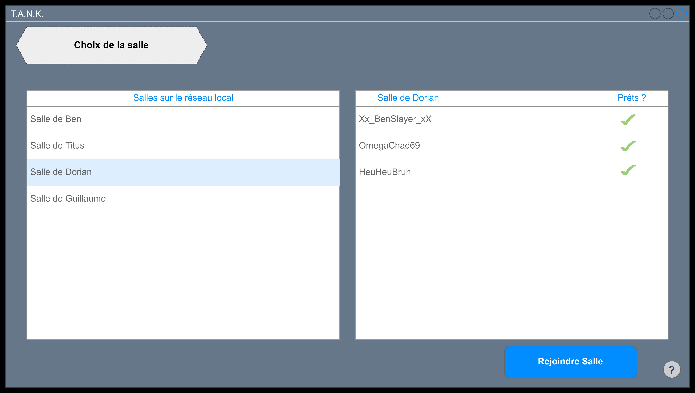
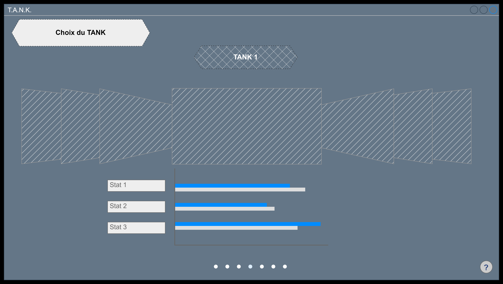
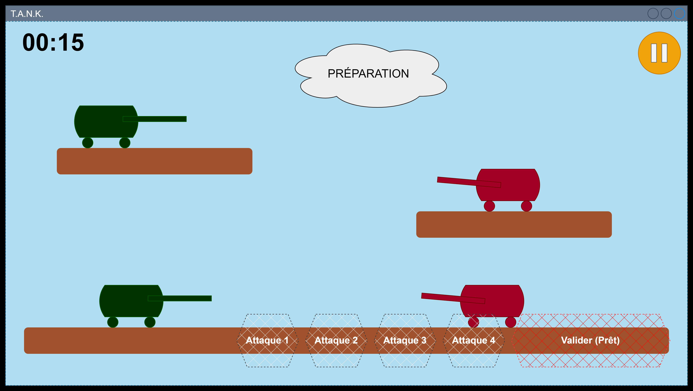
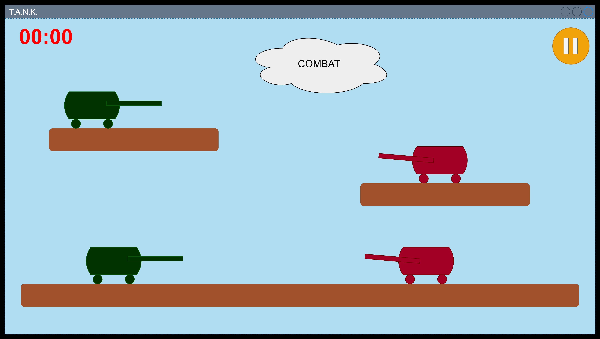
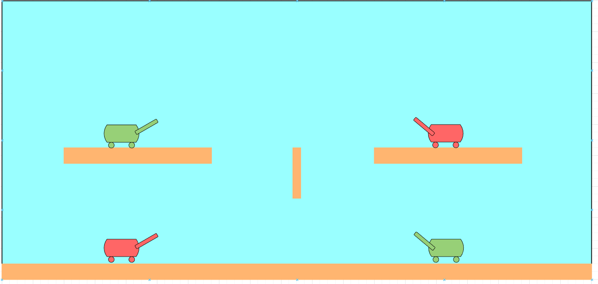
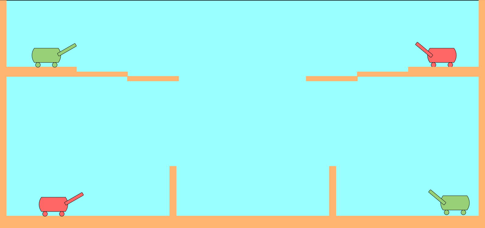
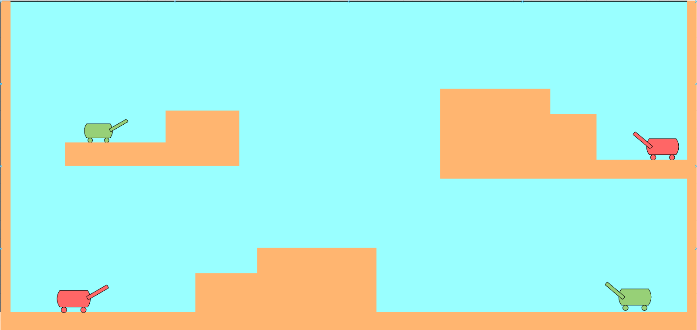

# Menu Principal

Le menu principal contient les boutons de navigation pour notamment aller dans les paramètres. La présentation des paramètres n'est pas encore complètement définie. Il y aura probablement plusieurs options audio et visuels afin de rendre l'expérience plus adéquate.

Si l'utilisateur choisit une nouvelle partie, il n'est pas encore évident ce qui arrive. Il faudra certainement créer automatiquement une nouvelle salle et lancer la sélection de TANK.

# Sélection de salle de jeu

Lorsque le joueur sélectionne une salle de jeu, il peut alors y observer les joueurs déjà présents ainsi que leur statut (prêt ou pas). La partie se lance lorsque tous les joueurs sont prêt. Il s'agit éventuellement de remplacer le bouton de sélection de salle par un bouton "Prêt!" après que l'utilisateur ait rejoint une salle.

# Sélection du TANK

Le joueur peut alors choisir un TANK et lorsque tous les joueurs ont choisit, la partie se lance. Il y aura certainement un timer de timeout pour éviter une sélection trop longue.

# Phase de Préparation

# Phase de Combat

# Maps

