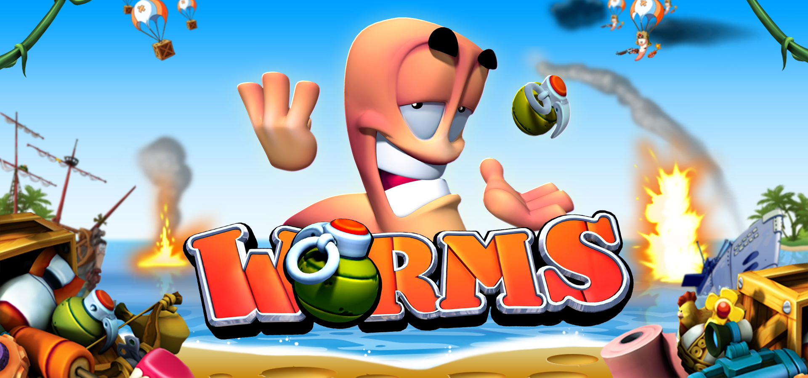
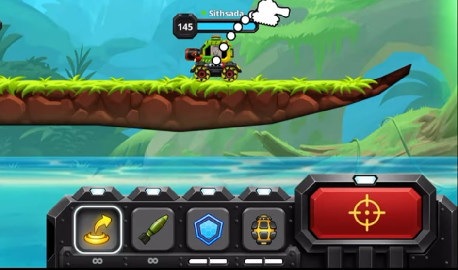
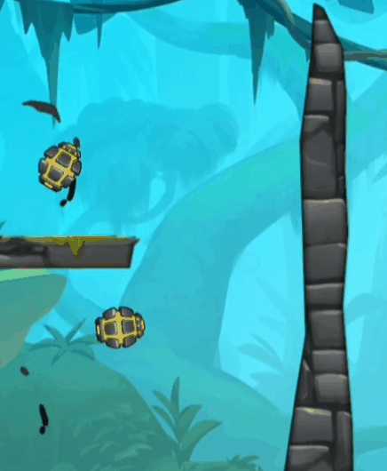
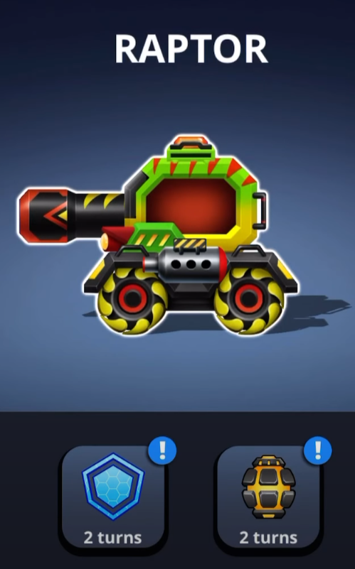

# Introduction
T.A.N.K est un jeu multijoueur créé sur Unity faisant affronter des tanks entre eux. Il se déroule en deux phases cruciales. La phase de préparation, ou chaque joueur choisit l'action qu'il souhaite entreprendre et la phase de combat qui se déclenche lorsque tous les joueurs ont choisi leur action. La phase de combat n'est rien d'autre que l'exécution simultanée de toutes les actions choisies auparavant par les joueurs. Ensuite une phase de Happening qui déclenche les événements et met sur le terrain des objets de soutiens. Le but du jeu est d'éliminer tous les adversaires. La structure de la carte et des actions possibles s'inspire des jeux [Worms](https://en.wikipedia.org/wiki/Worms_(series)) présentant un système similaire mais par du tour-par-tour au lieu des phases.

[Source Reddit](https://www.reddit.com/r/gaming/comments/bhysgr/has_everyone_forgot_this_amazing_game_worms_is/)

Cependant ce qui peut paraître long dans <i>Worms</i> est le fait de devoir attendre que chaque joueur joue son tour. Dans T.A.N.K tous les joueurs doivent valider leur action lors d'une phase de préparation puis ensuite quand tous les joueurs ont validé leur choix ou que le chronomètre de la phase est fini, toutes les actions sont effectuées en même temps. Ainsi pour maitriser le jeu il faut donc faire preuve de lecture de son adversaire et d'anticipation.

Capture d'écran du jeu [Brawlbot de Plato](https://play.google.com/store/apps/details?id=com.plato.android&gl=th)

# Objectifs principaux
## Partie en LAN
Le jeu se déroule dans un réseau local hébergé par l'un des joueurs. Comme chaque action est basée sur l'anticipation des autres joueurs, faire la partie sur une seule machine en local n'est pas une solution adéquate. Nous avons décidé d'utiliser l'asset Photon Pun 2 (gratuit) afin de gérer les interactions sur le réseau. 

## Physique
Plusieurs projectiles dans le jeu auront une physique, par exemple les missiles lancés depuis les tanks ont une courbure dûe à la gravité. D'autres objets peuvent rebondir contre les murs ou tomber dans un trou. Les tanks pourront aussi se déplacer selon la trajectoire choisie.

Capture d'écran du jeu [Brawlbot de Plato](https://play.google.com/store/apps/details?id=com.plato.android&gl=th)

## Map
Une [carte](https://gitlab-etu.ing.he-arc.ch/isc/2022-23/niveau-3/3281-projet-p3-hes-ete/gr-2-tank/-/wikis/Maquette) de base est proposée pour essayer les divers atouts des tanks et spécificité du jeu.

## Tank et kit
Tous les tanks posséderons 4 slots d'actions chacun, 2 actions commune pour tous et 2 spécifiques au tank choisis. Lors de la phase de préparation, une seul action par tank est possible pendant cette phase.

### Actions commune
- Déplacement sous forme d'un bond selon la trajectoire définie.
- Un tir de missile infligeant des dégâts modérés.

### Actions spécifique du tank de base
- Lancement d'une grenade pouvant rebondir sur une surface avant explosion.
- Déploiement d'un bouclier directionnel renvoyant les projectiles.

Capture d'écran du jeu [Brawlbot de Plato](https://play.google.com/store/apps/details?id=com.plato.android&gl=th)

## Phases du jeu
Mise en place des différentes phases du jeu.
- Préparation: En premier lieu un chronomètre est lancé et c'est durant cette phase que tous les joueurs peuvent choisir ce qu'ils désirent effectuer pendant ce tour. Une fois toutes les actions validées ou le chrono arrivant à sa fin la deuxième phase peut commencer.
- Combats : Durant cette phase toutes les actions enregistrées pendant le tour précédent sont lancées en même temps.
- Happenings : Annonce ou exécute le prochain Happening de type évènement, ensuite ajoute de manière aléatoire des objets de soutiens.
- Analyse : Effectué après la phase de combats et de Happenings, pour savoir si il y a des morts, si il y a une fin de partie ou si la partie continue et remet les tanks dans leurs états de base (sans les bouclier ou amélioration) et de recommencer la phase de préparation.

## Assets
Pour un meilleur rendu du jeu et une identité propre des [assets](https://kenney.nl/assets/tanks) sont utilisés.

# Objectifs secondaires
## Happenings
Pour rendre le jeu plus imprévisible et donc plus palpitant, différentes actions seront activées dans le jeu durant certains tours. Ces différentes actions sont indépendantes des actions des joueurs.

### Happening de type évènement
- Frappe de napalm (pluie de missiles)
- Pluie de mines
- Changement de météo 
    - un vent qui modifie les trajectoire des projectiles
    - de la pluie qui réduit le coefficient de friction des surfaces
    - une pluie de météorites qui peuvent détruire des parties du terrain
    - 
### Happening de type objets de soutiens
- Pack de soins
- Réduction de temps de latence
- Amélioration des dégâts

## Plus de tanks
Une plus grande variété de tanks et de kits permet un plus large panel de stratégie et de diversité lors des combats.

### Types de tanks
- Un tank de soutien permettant de lancer un pack de soin qui soigne le premier tank qu'il rencontre, il peut aussi poser une mine collante sur n'importe quelle surface
- Le tank assassin est capable de lancer un grapin pour s'approcher des ennemis, il possède aussi deux lames pour le combat au corps-à-corps
- Le technicien est capable de lancer un pack de munitions, il peut aussi faire un tir d'artillerie (tir fractionné).

## Plus de maps 
Comme pour les différents tanks, un plus grand choix de map peut amener à jouer différemment, selon le nombre de joueurs la map peut être plus ou moins grande.

## Plusieurs modes de jeu
Le mode 1 contre 1 est le mode de base, cependant un plus large choix de mode comme le tous contre tous ou des équipes plus ou moins nombreuses est prévu.

## Bruitages et musique
Pour une expérience complète il est nécessaire de mettre à contribution le plus de sens possible, dont l'ouï. Une musique contribue grandement à l'identité d'un jeu vidéo.

## Éléments destructibles
Toujours dans l'optique d'approfondir les possibilités du jeu et de stratégie utilisées par les joueurs, des éléments avec lesquelles les joueurs peuvent interagir sont nécessaire. De ce fait, le joueur pourra modeler la map à son avantage pour surprendre ses adversaires.